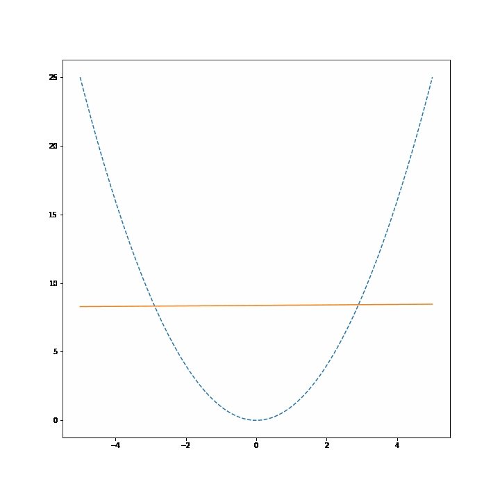
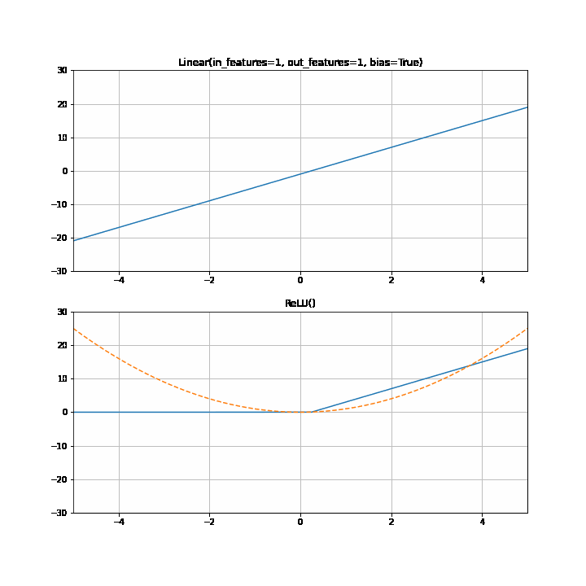

# An introduction to activation functions or why we use ReLUs
A neural network is essentially a stack of functions that try to approximate an unknown goal function, by adapting the weights in each layer. If you add more layers, you add more complexity and hence give the network the ability to learn more complex functions. Nevertheless, if you only stack linear functions on top of each other, the resulting function remains linear, so the network can only solve well, linear problems.\
$f(X) = W_1X + b_1$\
$g(X) = W_2X + b_2$\
$g(f(X)) = \underbrace{W_2W_1}_{W_3}X + \underbrace{W_2b_1 + b_2}_{b_3}$\
If we'd try to aproximate a quadratic function using only a linear layer, we'd end up with the training process looking something like this:

The gradient would jump between the left and right tails of the quadratic, without being able to find a suitable approximation.
Still, we like linear functions, they have a constant gradient and they are differentiable in all points. So this is where activation functions come into play, which allow the model to go beyond linearity by wrapping the linear functions in each layer in some non linear space.\
$a(f(x)) = a(W_1x +b)$

## Overview of common activation functions
In this section some of the most commonly used activation functions are introduced, as well as a brief discussion of their advantages and flaws.

### **sigmoid**
$f(x) = \frac{1}{1+e^{-x}}$

The sigmoid maps values between 0 and 1, this makes it useful to predict a probability. As such, it is a popular pick when solving binary output classification problems and is usually used as the activation function before computing the binary cross entropy loss. A downside of the sigmoid is the so called vanishing gradient problem, which describes the small value range for which the function receives a gradient back, localized around zero. 
### **tanh**
$f(x) = tanh(x)$

The tanh maps values between -1 and 1, it is very similar to the sigmoid function but with the advantage of a higher gradient around 0. Nevertheless, it still poses no solution to the vanishing gradient problem.
### **ReLU**
$f(x) = max(0,x)$

The  Rectified Linear Unit maps values smaller then 0 to 0 and positive numbers stay the same. This allows for a much larger range of values for which the network receives a gradient, as the derivative is either 0 for values smaller or equal to 0, or 1. 
### **leaky ReLU**
$f(x;\alpha) = max(\alpha x,x)$

There are many derivations of the classical ReLU, with the leaky ReLU allowing for gradients for values below 0.
## Why we use ReLUs
Now that we have introduced some of the most popular activation functions, as well as established the downsides of tanh and sigmoid, it's time to give some intuition on how ReLUs work. After all, it seems nice that we get a gradient and all, but *how* exactly do we aproximate a function simply by setting all values smaller than zero to zero? The ReLU afterall doesn't look that far from the Linear function, right?
Well that's the beauty of it all. The simplicity of the ReLU allows you to aproximate a function by glueing together *piecewise* linear functions.\
To give some intuition to this idea, we will observe a ReLU network solving a simple function, layer by layer.
### Example: Approximating $x^2$
We want to build a network that approximates the square function:\
$f(x)=x^2$\
With each layer in the network having the form\
$max(0,Wx+b)$\
If we start with a single Linear Layer with ReLU activation\
$l_1(x) = max(0,wx+b)$ with $w,b,x \in R $\
 and visualize the training process, we can see the following behaviour: \

Clearly, the added ReLU is an improvement to a single linear function, nevertheless the network only manages to give a broad approximation for positive input values. This is not surprising, given that the ReLU only returns positive values and sets everything else to 0. So in order to give the network the oppurtunity to remember the negative values as well, it needs to get a chance to switch the sign of said negative values without loosing the positive values in the process.
To achieve this, we therefore need to give the network some additional space to treat negative values different from positive ones:\
$l_1(x) = max(0,\mathbf{w}_1x+b_1)$\
$l_2(x) = \mathbf{w}_2x+b$\
with with $b_1,b_2 \in \mathbb{R}$ and $\mathbf{w}_1,\mathbf{w}^T_2 \in \mathbb{R}^2$

Looks much better, right?\
If we wanted to get even clearer results, we could add some more layers with ReLU activations.