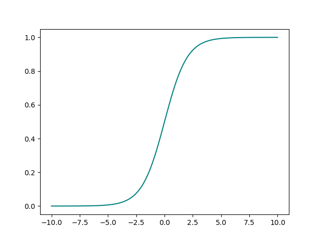
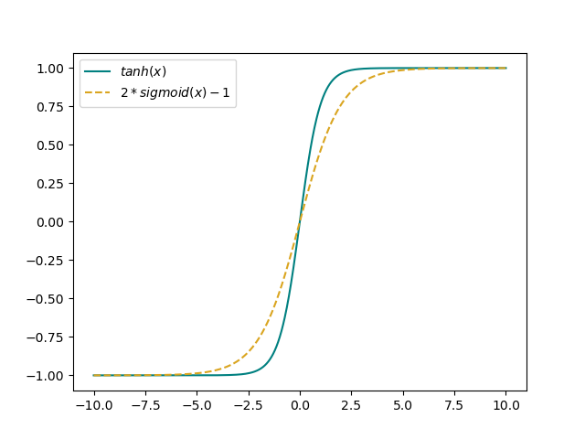
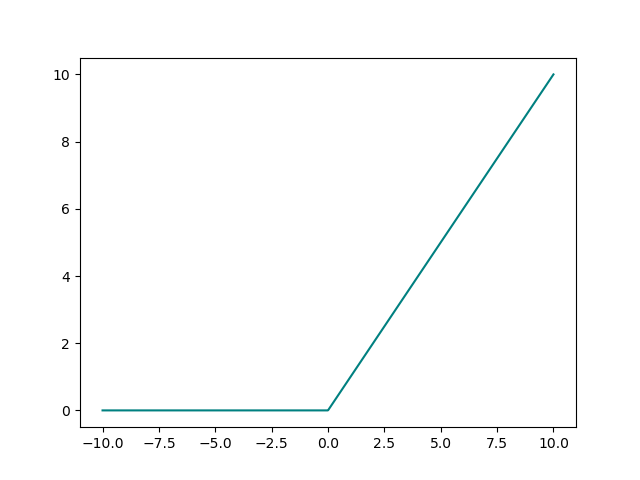
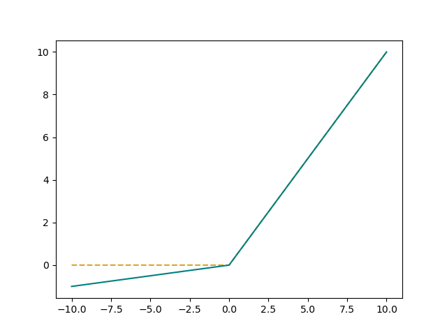

# An introduction to activation functions
add introduction here
## Overview of common activation functions

### **sigmoid**
$f(x) = \frac{1}{1+e^{-x}}$

### **tanh**
$f(x) = tanh(x)$

### **ReLU**
$f(x) = max(0,x)$

### **leaky ReLU**
$f(x;\alpha) = max(\alpha x,x)$

